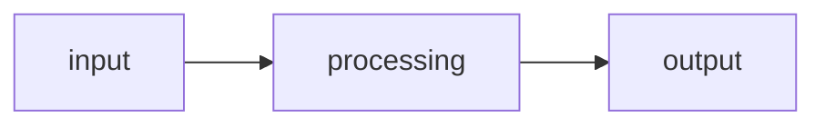

# welcome to cs50 
# week 0 (Scratch)
### in scratch we will study the basic fundamentals about computers and programming in C 

  
## the course is based on 
* number system
* ASCII
* Unicode
* Scratch
*  MIT (scratch program)

#  number system
The number system is based on  
* unary
* binary
* octal
* decimal
* hexa_decimal

# Unary
As time has rolled on, there are more and more ways to communicate via text.
* Since there were not enough digits in binary to represent all the various characters that could be represented by humans, the Unicode standard expanded the number of bits that can be transmitted and understood by computers.
* Unicode includes not only special characters, but emoji as well.
* There are emoji that you probably use every day. The following may look familiar to you:
* Computer scientists faced a challenge when wanting to assign various skin tones to each emoji to allow the communication to be further personalized.
*  In this case, the creators and contributors of emoji decided that the initial bits would be the structure of the emoji itself, followed by skin tone.
* `For example`, the unicode for a generic `thumbs up is U+1F44D`. However, the following represents the same thumbs up with a different `skin tone: U+1F44D U+1F3FD`.
* More and more features are being added to the Unicode standard to represent further characters and emoji.

# Binary 
* all the computers use the binary lanaguage also known as the `Machine language`
* it is based on 1s and 0s
* binary was used in punch cards for computer operations back then, the cards use to contain the 
information in binary which use to be reconized by the computer

# Decimal
* `Definition`
* The decimal numeral system is a base-ten positional numeral system used to represent integer and non-integer numbers.
* `Decimal Notation`
* Refers to how numbers are denoted in the decimal system, often called decimal notation.
* `Decimal Fractions`
* Numbers that can be represented in the decimal system, such as fractions of the form a/10^n.
* `Approximation`
* Decimals are commonly used to approximate real numbers by increasing the digits after the decimal separator.
* `Infinite Decimals`
* The decimal system can be extended to represent any real number with an infinite sequence of digits after the decimal separator

# Octal 
* The octal number system is a `base-8` number system that uses the digits `0 to 7`. It is widely used in computer programming and digital systems because it is a compact way of representing binary numbers with each octal number corresponding to three binary digits.

# Hexa_Decimal
* `Definition`
* A positional numeral system that uses 16 distinct symbols (0-9 and A-F) to represent numbers.
* `Symbol Range`
* Uses symbols "0"-"9" to represent values 0 to 9, and "A"-"F" to represent values ten to fifteen.
* `Common Use`
* Widely used by software developers and system designers for a human-friendly representation of binary-coded values.
* `Bit Representation`
* Each hexadecimal digit represents four bits, also known as a nibble; an 8-bit byte ranges from 00 to FF in hexadecimal.
* `Mathematical Notation`
* In mathematics, uses subscripts to denote hexadecimal base; e.g., 40,405 in decimal is 9DD5~16~.
* `Programming Notation` 
* In programming, hexadecimal numbers are often denoted with a prefix, such as `0x` for the C programming language.

# Computational Thinking
Essentially, computer programming is about taking some input and creating some output - thus solving a problem. What happens in between the input and output, what we could call a black box, is the focus of this course.

* `For example,` we may need to take attendance for a class. We could use a system called unary to count, one finger at a time. Computers today count using a system called binary. It’s from the term binary digit that we get a familiar term called bit. A bit is a zero or one.
* Computers only speak in terms of zeros and ones. Zeros represent off. Ones represent on. Computers are millions, and perhaps billions, of transistors that are being turned on and off.
* If you imagine using a light bulb, a single bulb can only count from zero to one.
* However, if you were to have three light bulbs, there are more options open to you!
* Using three light bulbs, the following could represent zero:
```
  0 0 0
```
* Similarly, the following would represent one:
```
  0 0 1
```
* By this logic, we could propose that the following equals two:
```
  0 1 0
```
* Extending this logic further, the following represents three:
```
  0 1 1
```
* Four would appear as:
```
  1 0 0
```
* We could, in fact, using only three light bulbs count as high as seven!
```
  1 1 1
```
* As a heuristic, we could imagine that the following values represent each possible place in our binary digit:
```
  4 2 1
```
* Computers use ‘base-2’ to count. This can be pictured as follows:
```
  2^2  2^1  2^0
  4    2    1
```
* Therefore, you could say that it would require three bits (the four’s place, the two’s place, and the one’s place) to represent a number as high as seven.

* Computers generally use eight bits to represent a number. For example,` 00000101` is the number `5 in binary`.
  
# ASCII / Text
* `Full Name`
* American Standard Code for Information Interchange
* `Purpose`
* Represent text in computers, telecommunications equipment, and other devices
* `Total Code Points`
* 128, of which 95 are printable characters
* `Evolution`
* Modern computer systems now use Unicode, which includes ASCII's first 128 code points
* Just as numbers are binary patterns of ones and zeros, letters are represented using ones and zeros too!
* Since there is an overlap between the ones and zeros that represent numbers and letters, the ASCII standard was created to map specific letters to specific numbers.
* `For example:` the letter A was decided to map to the number 65.
* If you received a text message, the binary under that message might represent the numbers 72, 73, and 33. Mapping these out to ASCII, your message would look as follows:
```
  H   I   !
  72  73  33
```
# RGB
* Red, green, and blue (called RGB) is a combination of three numbers.

* Taking our previously used 72, 73, and 33, which said HI! via text, would be interpreted by image readers as a light shade of yellow. The red value would be 72, the green value would be 73, and the blue would be 33.

## Images, Video and Sound
* Images are simply collections of RGB values.
* Videos are sequences of many images that are stored together, just like a flipbook.
* Music can be represented through MIDI data.

# Algorithms
* Problem-solving is central to computer science and computer programming.
* Imagine the basic problem of trying to locate a single name in a phone book.
* How might you go about this?
* One approach could be to simply read from page one to the next to the next until reaching the last page.

# Pseudocode and the Basic Building Blocks of Programming
* The ability to create pseudocode is central to one’s success in both this class and in computer programming.
* `Pseudocode is a human-readable version of your code`.
* For example, considering the third algorithm above, we could compose pseudocode as follows:
```
  1  Pick up phone book
  2  Open to middle of phone book
  3  Look at page
  4  If person is on page
  5      Call person
  6  Else if person is earlier in book
  7      Open to middle of left half of book
  8      Go back to line 3
  9  Else if person is later in book
  10     Open to middle of right half of book
  11     Go back to line 3
  12 Else
  13     Quit
```
#### Another approach could be to search two pages at a time.
* A final and perhaps better approach could be to go to the middle of the phone book and ask, “Is the name I am looking for to the left or to the right?” Then, repeat this process, cutting the problem in half and half and half.
* Pseudocoding is such an important skill for at least two reasons. First, when you pseudocode before you create formal code, it allows you to think through the logic of your problem in advance.
* Second, when you pseudocode, you can later provide this information to others that are seeking to understand your coding decisions and how your code works.
* Notice that the language within our pseudocode has some unique features. First, some of these lines begin with verbs like pick up, open, look at. Later, we will call these functions.
* Second, notice that some lines include statements like if or else if. These are called conditionals.
* Third, notice how there are expressions that can be stated as true or false, such as “person is earlier in the book.” We call these boolean expressions.
* Finally, notice how these statements like “go back to line 3.” We call these loops.
* In the context of Scratch, which is discussed below, we will use each of the above basic building blocks of programming.


    
